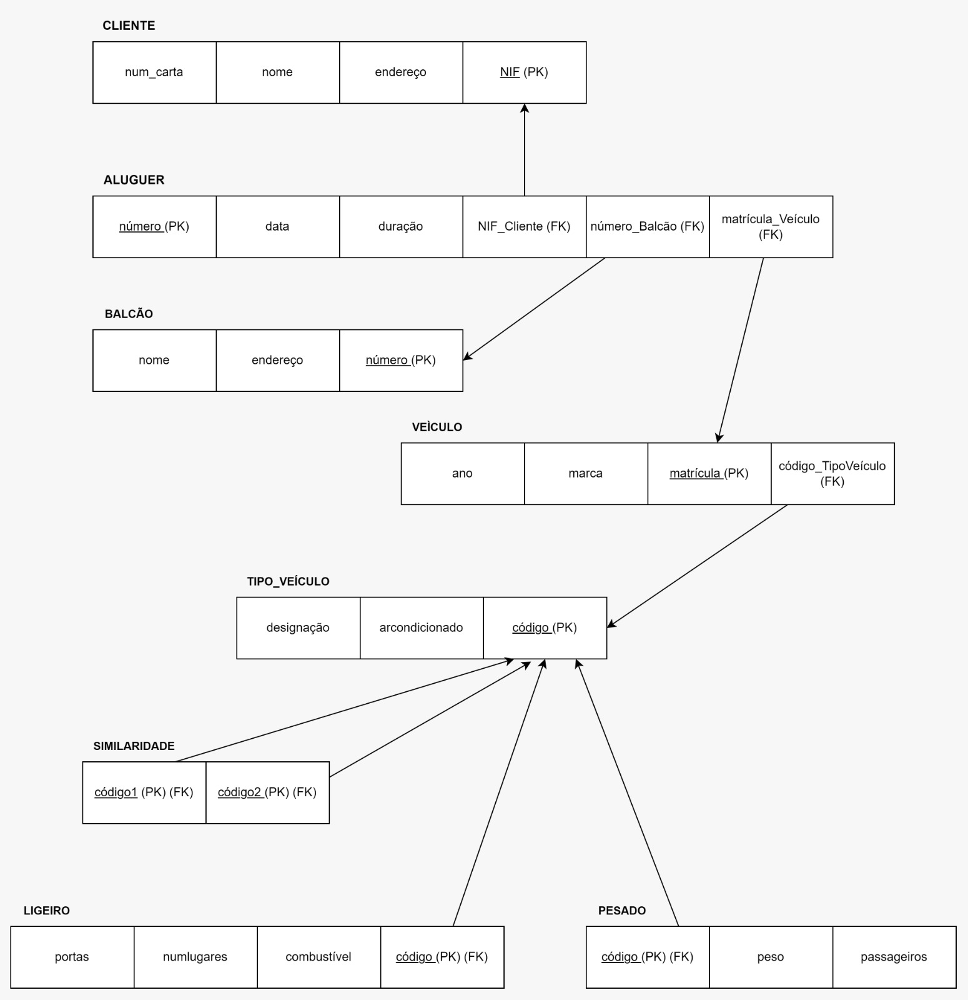
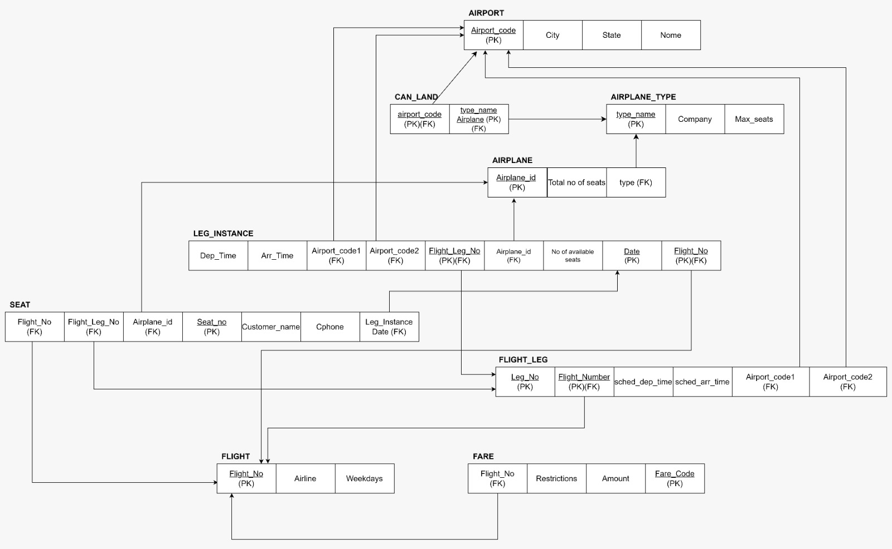
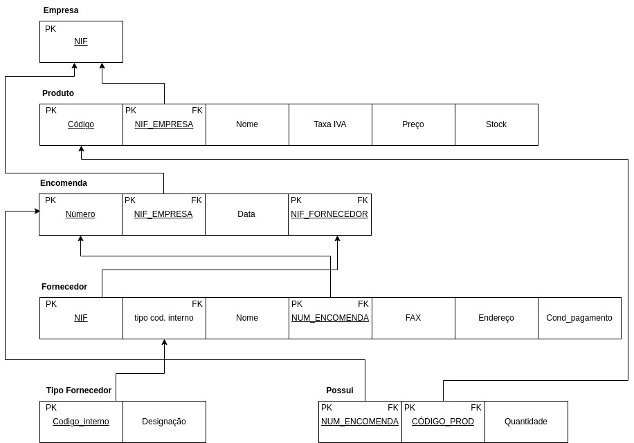
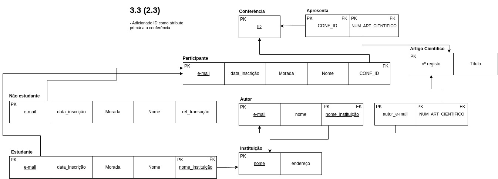
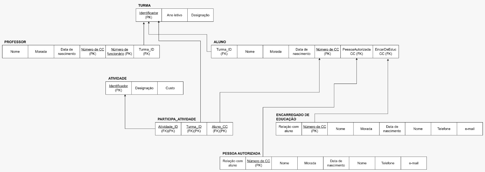

# BD: Guião 3


## ​Problema 3.1
 
### *a)*

```
Relações:
 - CLIENTE(*NIF, nome, endereço, num_carta)  
 - ALUGUER(*número, duração, data)
 - BALCÃO(*número, nome, endereço)
 - VEÍCULO(*matrícula, marca, ano)
 - TIPO_VEÍCULO(*código, arcondicionado, designação)
 - SIMILARIDADE(*código1, *código2)
 - LIGEIRO(*combustível, portas, numlugares)
 - PESADO(*peso, passageiros)

```


### *b)* 

```
Cliente:
 - Chaves candidatas: NIF, num_carta;
 - Chaves primária: NIF
 - Chaves estrangeiras: \

Aluger:
 - Chaves candidatas: número;
 - Chaves primária: número;
 - Chaves estrangeiras: titular, local, objeto

Balcão:
 - Chaves candidatas: número;
 - Chaves primária: número;
 - Chaves estrangeiras: \

Veículo:
 - Chaves candidatas: matrícula;
 - Chaves primária: matrícula;
 - Chaves estrangeiras: tipo

Tipo_Veículo:
 - Chaves candidatas: código;
 - Chaves primária: código;
 - Chaves estrangeiras: \

Similaridade:
 - Chaves candidatas: código1, código2;
 - Chaves primária: código1, código2;
 - Chaves estrangeiras: código1, código2

Ligeiro:
 - Chaves candidatas: código;
 - Chaves primária: código;
 - Chaves estrangeiras: código

Pesado:
 - Chaves candidatas: código;
 - Chaves primária: código;
 - Chaves estrangeiras: código


```


### *c)* 




## ​Problema 3.2

### *a)*

```
Relações:
 - AIRPORT(*airport_code, city, state, name);
 - CAN_LAND(*airplane_type, *airport);
 - AIRPLANE_TYPE(*type_name, max_seats, company);
 - AIRPLANE(*airplane_id, total_no_of_seats);
 - SEAT(*seat_no, date, number, costumer_name, cphone, leg_number);
 - FLIGHT(*number, airline, weekdays)
 - FLIGHT_LEG(*leg_no, *flight_number airport_code1, airport_code2, scheduled_dep_time, scheduled_arr_time);
 - FARE(*code, amount, restrictions, number);
 - LEG_INSTANCE(*date, no_of_avail_seats, *flight_number, *flight_leg_no, airport_code1, airport_code2, dep_time, arr_time, airplane);
 

```


### *b)* 

```
AIRPORT:
 - Chaves candidatas: airport_code, name
 - Chaves primária: airport_code
 - Chaves estrangeiras: \

CAN_LAND:
 - Chaves candidatas: airport_code, type_name
 - Chaves primária: airport_code, type_name
 - Chaves estrangeiras: airport_code, type_name

AIRPLANE_TYPE:
 - Chaves candidatas: type_name
 - Chaves primária: type_name
 - Chaves estrangeiras: \

AIRPLANE:
 - Chaves candidatas: airplane_id
 - Chaves primária: airplane_id
 - Chaves estrangeiras: airplane_type

LEG_INSTANCE:
 - Chaves candidatas: date
 - Chaves primária: flight_number, leg_no, date
 - Chaves estrangeiras: flight_number, leg_no, airport_code1, airport_code2, date, airplane_id

SEAT:
 - Chaves candidatas: seat_no, costumer_name
 - Chaves primária: seat_no
 - Chaves estrangeiras: flight_number, leg_number, date

FLIGHT:
 - Chaves candidatas: flight_number
 - Chaves primária: flight_number
 - Chaves estrangeiras: \

FLIGHT_LEG:
 - Chaves candidatas: leg_no
 - Chaves primária: leg_no
 - Chaves estrangeiras: flight_number, leg_no, airport_code1, airport_code2


FARE:
 - Chaves candidatas: code
 - Chaves primária: code
 - Chaves estrangeiras: flight_number

```


### *c)* 




## ​Problema 3.3


### *a)* 2.1



### *b)* 2.2


### *c)* 2.3



### *d)* 2.4

