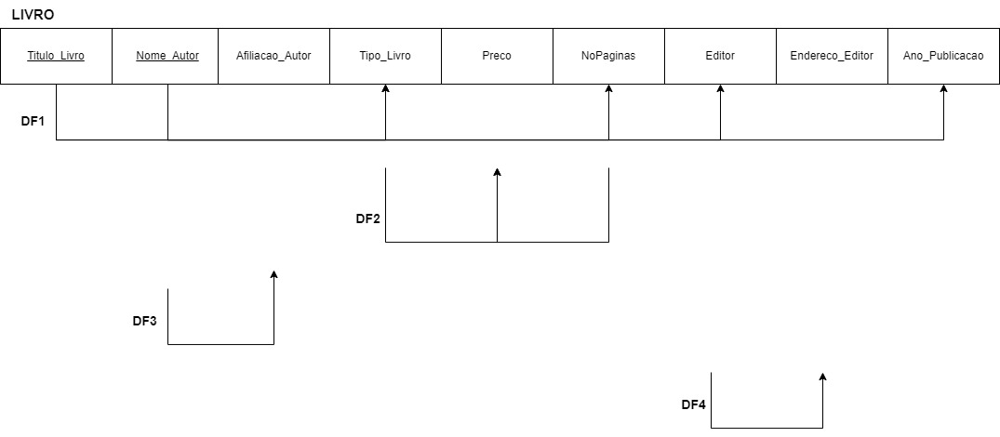
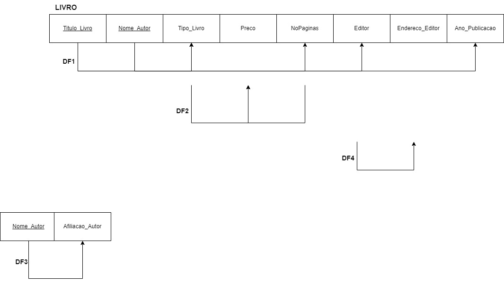
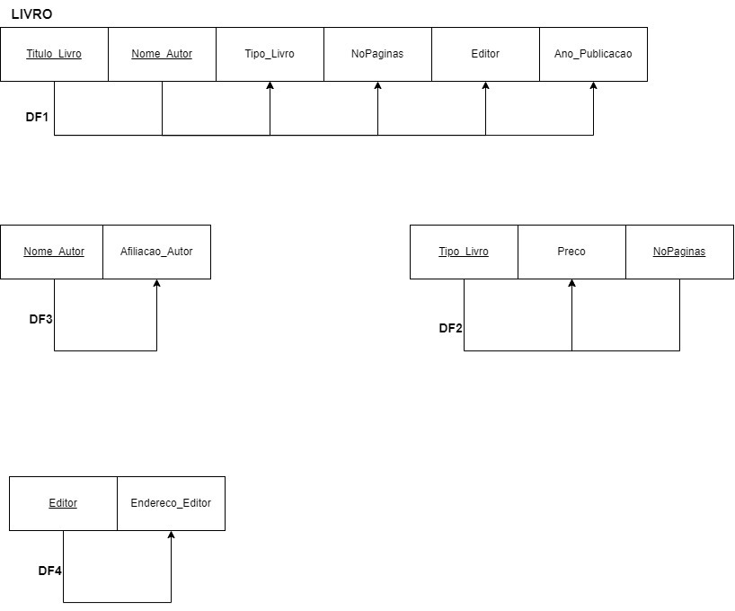

# BD: Guião 7


## ​7.2 
 
### *a)*

```
A relação atual está na 1ª Forma Normal (1FN) porque todos os atributos são atômicos, são simples e indivisíveis, e não contém relações dentro de relações.
```

### *b)* 

```
1FN:
```

```
Para a 2ª Forma Normal, precisamos remover as dependências funcionais parciais. Existe dependência entre Nome_Autor (Chave) e Afiliação_Autor. Separa-se numa nova tabela (*Nome_Autor, Afiliação_Autor).
```

```
Agora, para atingir a 3ª Forma Normal, precisamos remover as dependências transitivas, criando as tabelas (*Editor, Endereço_Editor) e L4 (*Tipo_Livro, *NoPaginas, Preço).
```



## ​7.3
 
### *a)*

```
... Write here your answer ...
```


### *b)* 

```
... Write here your answer ...
```


### *c)* 

```
... Write here your answer ...
```


## ​7.4
 
### *a)*

```
... Write here your answer ...
```


### *b)* 

```
... Write here your answer ...
```


### *c)* 

```
... Write here your answer ...
```


## ​7.5
 
### *a)*

```
... Write here your answer ...
```

### *b)* 

```
... Write here your answer ...
```


### *c)* 

```
... Write here your answer ...
```

### *d)* 

```
... Write here your answer ...
```
